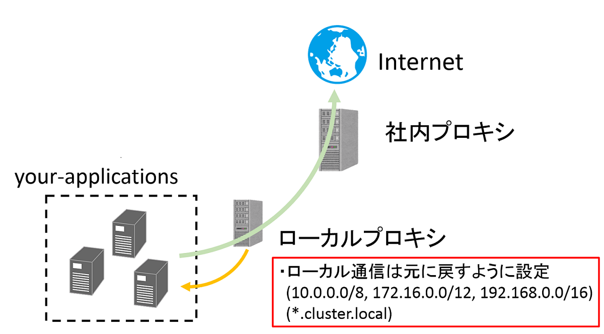

# Local-Proxy

## Overview

このリポジトリは社内プロキシとアプリケーションの間のローカルなプロキシを配備するための設定方法を示したものです。

## Why need?

アプリケーションから直接社内プロキシにつなぐ場合プロキシにつなぎたくない通信(例えば192.168.0.0/16)はno_proxyに設定する必要があります。  
しかし、no_proxyはワイルドカードが指定できないので一つずつ指定する必要があります(192.168.0.1, 192.168.0.2, ...)  
このリポジトリはno_proxyを書かなくてもローカル通信を社内プロキシに行かせないためにローカルプロキシを立てる方法を示しています。

## Prerequire

- CentOS 7

## How to use

1. squidのインストール
    - yum install squid
2. squid.confの編集
    - vi ./squid.conf  
    60行目付近のcache_peerに上位プロキシ(社内プロキシ)情報を指定してください。  
    ※デフォルトでlocal-serversとlocal-domain(53～58行目)を登録しています。必要に応じて修正してください。
3. squid.confのコピーとsquidの起動
    - cp ./squid.conf /etc/squid/squid.conf
    - systemctl start squid
    - systemctl enable squid
4. proxyを使うようにアプリを修正
    - export http_proxy=http:\<your-local-proxy-address\>:3128
    - export https_proxy=http:\<your-local-proxy-address\>:3128

## Author

Shunsuke Miyoshi
